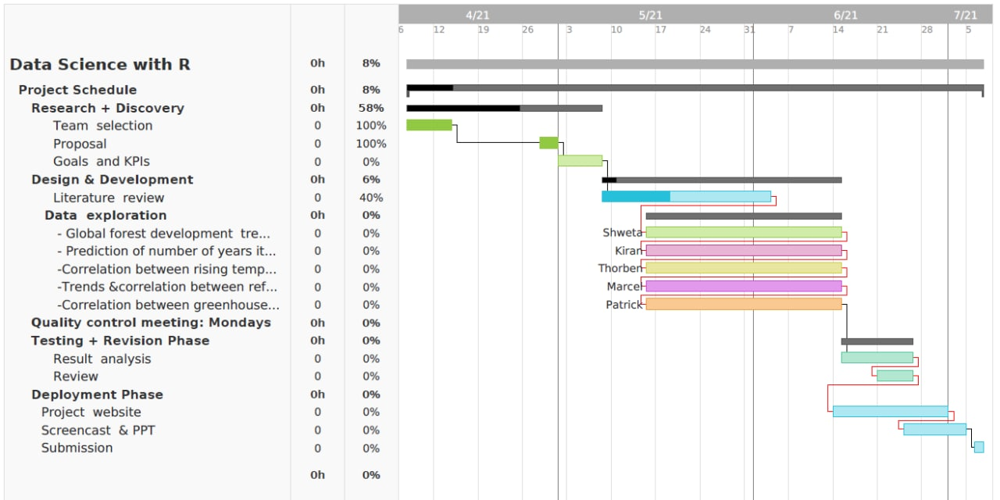

```{r setup, include=FALSE}
knitr::opts_chunk$set(echo = TRUE)
library(tidyverse)
```

## Background and Motivation

The existence of forests is essential for our life on Earth. By covering around 31 percent of the world’s total land area, forests provide a retreat and home to over 80 percent of land animals and countless partially even undiscovered plants. One can say that forests are the backbone of entire ecosystems. A significant part of the oxygen we breathe is provided by the trees, while they also absorb about 25 percent of greenhouse gases. Also economically we are dependent on forests as about 1.6 billion people around the world earn their livelihoods with forests. Furthermore, forests provide 40 percent of today’s global renewable energy supply, as much as solar, hydroelectric and wind power combined.
Despite these utilities, forestation across the world has faced several challenges ranging from wildfire, human-driven deforestation, poor management and poor conversation in general. However, a loss of whole forests would mean severe consequences to humanity and life on Earth.  

With this project we seek to answer important questions that address these challenges. We want to figure out the causes of destruction of forests, highlight their importance to our environment and predict trends around reforestation/deforestation. Moreover, we hope to show how we can tackle climate change by reforestation, in particular, how an increase in the forest’s area will help to increase the buffer of sustainability.
For the statistics so far, see our [reference](https://unece.org/forestry/news/10-facts-fall-love-forests#:~:text=1) (Opened on 07th of May, 2021).


## Objectives

Questions we want to answer:

* What was the global forest development over the last 30 years?
  + What are the trends? (globally)

* What were the main causes of forest destruction?
  + Which countries were affected the most?
  + How much forest was destroyed by each of these causes?
  + Is there a correlation between rising temperatures and wildfires?
  + Prediction of where and when wildfires are likely to occur.

* Deforestation
  + Which countries are the main drivers of deforestation?
  + What are the trends? (by continents)
  + Prediction of how many years it would take until all forests are lost based on the current rate of change.

* Reforestation
  + Which countries are the main drivers of reforestation?
  + Is there a correlation between reforestation and deforestation?
  + What are the trends? (by continents)

* Relation to other environmental issues
  + Is there a correlation between air pollution and the amount of forest in a country / globally?
  + Is there a correlation between greenhouse gas emissions and total carbon stored in forests?
  + Prediction of how much forest area has to be further increased to tackle the greenhouse gas emissions (what percentage of greenhouse gas decrease will occur if forest area increases).
  + Is there a correlation between available water / precipitation and the amount of forest in a country /  on a continent?
  
* Further possible questions:
  + How has the general interest in forests changed? 
  + How much of the global forests belong to protected areas?
  + Is there a correlation between forest development and economic growth?
  + Is there a correlation between forest development and land use development?
  + What are the main reasons for deforestation?

## Datasets

These are the data sets we will use to answer our questions:

1. [FAO. 2020. Global Forest Resources Assessment 2020](https://fra-data.fao.org/WO/fra2020/home/)  
Consisting of 3 data sets:  
  1.1 Data on forest development (e.g. deforestation, reforestation)  for the intervals 1990-2000, 2000-2010, 2010-2015 and 2015-2020.  
  1.2 Data on forest disturbances (e.g. fire, weather) for the period 2000-2017.  
  1.3 Data on further topics (e.g. Forest Management / Ownership) for the period 1990-2020 (not every year included).

```{r echo=FALSE, message=FALSE}
intervals <- tibble(read_csv("FRA_2020_data/Intervals_2021_05_05.csv"))
annual <- tibble(read_csv("FRA_2020_data/Annual_2021_05_05.csv"))
glimpse(intervals %>% drop_na() %>% select(name, year, contains('1')))
```
```{r echo=FALSE, message=FALSE}
annual <- tibble(read_csv("FRA_2020_data/Annual_2021_05_05.csv"))
glimpse(annual %>% drop_na() %>% select(name, year, contains('5')))
```
```{r echo=FALSE, message=FALSE}
fra <- tibble(read_csv("FRA_2020_data/FRA_Years_2021_05_05.csv"))
glimpse(fra %>% select(name, year, '7a_employment_tot', '4a_priv_own'))
```

2. [FAO. 2020. FAOSTAT Emissions-Land Use, Forest Land dataset.](http://www.fao.org/faostat/en/#data/GF)  
Data on emissions and area change due to gain and losses of carbon stocks in living  (above ground  and  below ground) tree biomass for the period 1990–2020. 
```{r echo=FALSE, message=FALSE}
emissions <- tibble(read_csv("Emissions_Land_Use_Forest_Land_E_All_Data_(Normalized)/Emissions_Land_Use_Forest_Land_E_All_Data_(Normalized).csv"))
glimpse(emissions %>% select(Area, Item, Element, Year, Value))
```

3. [FAO. 2021. FAOSTAT Temperature Change Dataset](http://www.fao.org/faostat/en/#data/ET)  
Data on mean surface temperature change for the period 1961–2020. 
```{r echo=FALSE, message=FALSE}
temperature <- tibble(read_csv("Environment_Temperature_change_E_All_Data_(Normalized)/Environment_Temperature_change_E_All_Data_(Normalized).csv"))
glimpse(temperature %>% select(Area, Element, Year, Value))
```

4. [OECD. 2021. Air quality and health: Exposure to PM2.5 fine particles](https://stats.oecd.org/viewhtml.aspx?datasetcode=EXP_PM2_5&lang=en)  
Data on mean population exposures to outdoor and ambient PM2.5 particles for the period 1990–2018 (not every year included).
```{r echo=FALSE, message=FALSE}
pm2_5 <- tibble(read_csv("EXP_PM2_5_10052021161712459.csv"))
glimpse(pm2_5 %>% select(Country, Variable, Year, Value))
```

5. [CAIT data: Climate Watch. 2020. GHG Emissions](https://www.climatewatchdata.org/data-explorer/historical-emissions?historical-emissions-data-sources=cait&historical-emissions-gases=all-ghg&historical-emissions-regions=All%20Selected&historical-emissions-sectors=total-including-lucf&page=1)  
Data on greenhouse gas (GHG) emissions for the period 1990–2018. 
```{r echo=FALSE, message=FALSE, warning=FALSE}
ghg <- tibble(read_csv("historical_emissions.csv"))
glimpse(ghg %>% mutate(`1990` = as.double(`1990`)) %>% select(Country, Sector, Gas, `1990`, `2018`))
```

6. [FAO. 2021. AQUASTAT Database](http://www.fao.org/aquastat/statistics/query/results.html)  
Data on precipitation and renewable water resources (annual averages of the 1961-1990 period).
```{r echo=FALSE, message=FALSE, warning=FALSE}
tmp <- tibble(read_csv("aquastat.csv"))
aquastat <- tmp %>% filter(Year == 2017) %>% select(Area, `Variable Name`, Value) %>% pivot_wider(names_from = `Variable Name`, values_from = Value) %>% select(Area, `Long-term average annual precipitation in volume`, `Total renewable water resources`)
glimpse(aquastat)
```

## Design Overview

* For general data (pre-)processing and visualizations:
  + Tidyverse
  + PCA
* For finding trends / correlations / patterns:
  + Linear Regression
  + Correlation Coefficients
    + Pearson / Spearman / Kendall: depending on the type of data
  + Clustering (e.g. k-Means)
* For predictive questions:
  + Linear / Logistic Regression
  + Decision / Regression Trees
  + Neural Networks

## Time Plan

